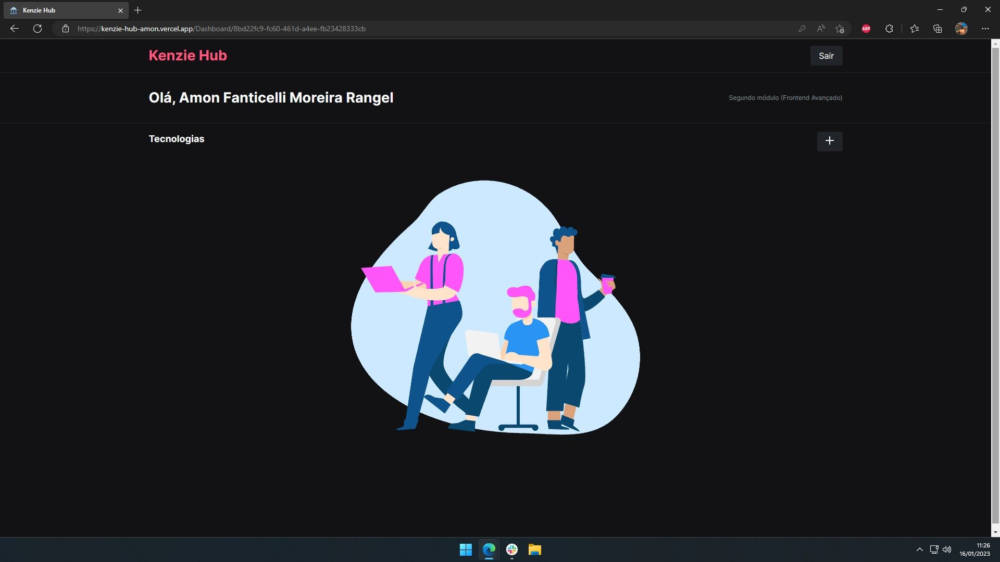

# Kenzie Hub

A front-end application for developers to manage their tech stack and track learning progress.



## Technologies

- React
- TypeScript
- Styled Components
- React Hook Form
- Yup
- Axios
- Framer Motion
- React Toastify

## Features

- User registration and authentication
- Protected dashboard route via JWT token
- Add, edit, and remove technologies from your personal list
- Track learning status per technology
- Form validation on login and registration

## Getting Started

```bash
yarn install
yarn dev
```

## Note

The original external API (Kenzie Academy) has been discontinued. The application will not function without a running backend. A local mock backend can be set up using json-server-auth — see the routes and data contract in `src/services/api.ts`.
